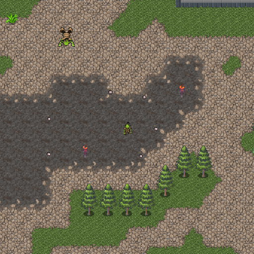

In this exercise you will implement a first sketch of a top-down tile-based action-adventure, like Zelda ([YouTube](https://www.youtube.com/watch?v=Z6hjG6MCcZ8)). We start out with the code that loads a tile based map from [Tiled](https://www.mapeditor.org/). Implement the following items and answer questions about your implementation and the used theory from the lecture (color, blending, textures, transformations, ...) (marked by a `//TODO` in the code):

#### Ways you could extend this exercise:
+ Create a new map
+ **Game elements** like portals, pick-ups (for instance a key to open doors/allow movement to certain parts of the level), power-ups, enemies/NPCs, a tile layer that is in front of the player, an inventory, animated tiles (fire), ...
+ A mini-map
+ Game-play
+ Only draw visible tiles

